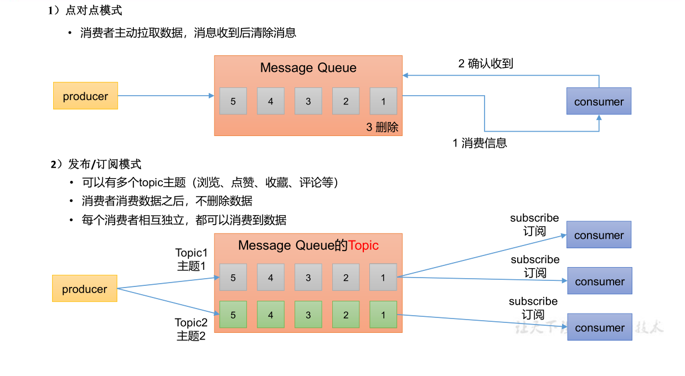
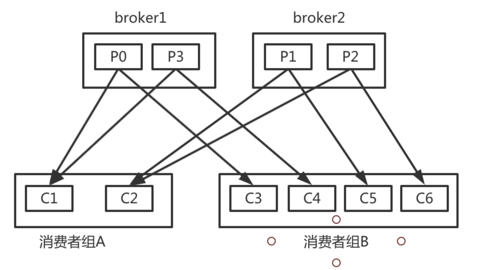
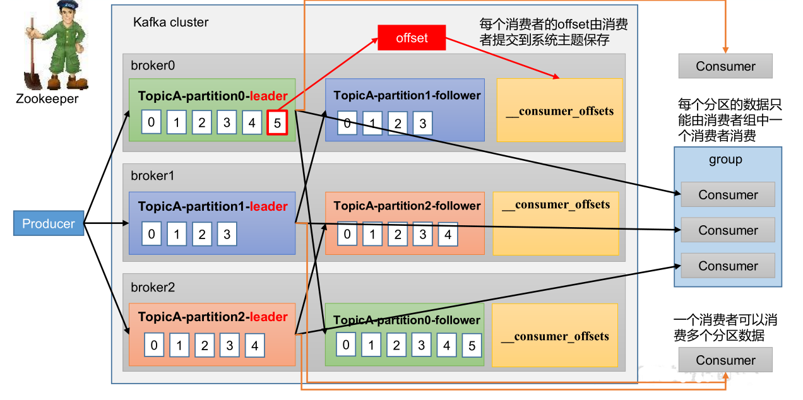

目录：

- <a href= "#title2">BPM ZT Kafka 接入</a>
    - <a href="#title2_sub1">1.Kafka 工作原理</a>
    - <a href="#title2_sub1">2.Spring Kafka 介绍</a>
    - <a href="#title2_sub1">3.ZT Kafka 封装包的使用</a>

# <a id="title2" name="title2"></a>BPM ZT Kafka 接入

## <a id="title2_sub1" name="title2_sub1"></a> 1.Kafaka 工作原理

### 1).kafka 的定义：

#### Kafka 的基本介绍：

1).Apache Kafka 是一个开源消息系统，由 Scala 写成。是由 Apache 软件基金会开发的 一个开源消息系统项目。

2).Kafka 最初是由 LinkedIn 公司开发，并于 2011 年初开源。2012 年 10 月从 Apache Incubator 毕业。该项目的目标是为处理实时数据提供一个统一、高通量、低等待的平台。

3).Kafka 是一个分布式消息队列。Kafka 对消息保存时根据 Topic 进行归类，发送消息 者称为 Producer，消息接受者称为 Consumer，此外 kafka 集群有多个 kafka 实例组成，每个 实例(server)
称为 broker。

#### 传统定义：

kafka 是一个分布式基于发布/订阅模式的消息队列（Messge Queue)，主要用于大数据实时处理领域。

发布/订阅： 消息的发布不会将消息直接发送给特定的订阅者，而是将发布的消息分为不同的类别，订阅者只接收感兴趣的消息。

#### 最新的定义：

kafka 是一个开源的分布式事件流平台（Event Streaming Platform），被数千件公司用于高性能数据管道、流分析、 数据集成和关键人任务应用。

### 2).kafka 的应用场景：

#### 缓存/消峰：有助于控制和优化数据流经过系统的速度，解决生产消息和消费消息的处理速度不一致的情况。


#### 解耦： 允许你独立的扩展或修改两边的处理过程，只要确保它们遵守同样的接口约束。


#### 异步通信：


#### 消息队列的两种模式：



###3).kafka 的组成：

#### 基础架构：


1).Producer ：消息生产者，就是向 Kafka broker发消息的客户端。

2).Consumer ：消息消费者，向 Kafka broker 取消息的客户端。

3).Consumer Group （CG ）：消费者组，由多个 consumer组成。 消费者组内每个消费者负责消费不同分区的数据，一个分区只能由一个 组内 消费者消费；消费者组之间互不影响。所有的消费者都属于某个消费者组，即
消费者组是逻辑上的一个订阅者。

4).Broker ：一台 Kafka 服务器就是一个 broker。一个集群由多个 broker 组成。一个broker可以容纳多个 topic。

5).Topic： ：可以理解为一个队列，个 生产者和消费者面向的都是一个 topic。

6).Partition ：为了实现扩展性，一个非常大的 topic 可以分布到多个 broker（即服务器）上，个 一个 topic 可以分为多个 partition，每个 partition 是一个有序的队列。

7).Replica ：副本。一个 topic 的每个分区都有若干个副本，一个 Leader 和若干个 Follower。

8).Leader ：每个分区多个副本的“主”，生产者发送数据的对象，以及消费者消费数据的对象都是 Leader。

9).Follower ：每个分区多个副本中的“从”，实时从 Leader 中同步数据，保持和Leader 数据的同步。Leader 发生故障时，某个 Follower 会成为新的 Leader。

#### 生产者发送流程：

在消息发送的过程中，涉及到了 两个线程 ——main 线程和 Sender 线程。在 main 线程 中创建了 一个 双端列 队列 RecordAccumulator。main线程将消息发送给 RecordAccumulator，
Sender线程不断从 RecordAccumulator 中拉取消息发送到 Kafka Broker。


• batch.size ：只有数据积累到batch.size之后，sender才会发送数据。默认16k

• linger.ms ：如果数据迟迟未达到batch.size，sender等待linger.time之后就会 发送数据。单位ms，默认值是0ms，表示没有延迟。

#### acks 应答级别：


acks=0，生产者发送过来数据就不管了，可靠性差，效率高；

acks=1，生产者发送过来数据Leader 应答，可靠性中等，效率中等；

acks=-1，生产者发送过来数据Leader 和ISR 队列里面所有Follwer 应答，可靠性高 ，效率低；

> 在生产环境中， acks=0 很少使用；acks=1， 一般用于传输普通日志 ， 允许丢个别数据；acks=-1，一般用于传输和钱相关的数据，对可靠性要求比较高的场景 。

> 数据完全可靠条件：ACK 级别设置为-1 + 分区副本大于等于2 + ISR 里应答的的最小副本数量大于等于2

```
  参考项目目录下的 KafkaSpringModule 代码
```

#### 消费者：


消费者组定义：消费者使用一个消费者组名（即group.id）来标记自己，topic的每条消息都只会被发送到每个订阅它的消费者组的一个消费者实例上

> 一个consumer group可能有若干个consumer实例
> 对于同一个group而言，topic的每条消息只能被发送到group下的一个consumer实例上
> topic消息可以被发送到多个group中

Kafka同时支持基于队列和基于发布/订阅的两种消息引擎模型，事实上Kafka是通过consumer group实现对这两种模型的支持

> 所有consumer实例都属于相同group—实现基于队列的模型，每条消息只会被一个consumer实例处理
> consumer实例都属于不同group—实现基于发布/订阅的模型，极端的情况是每个consumer实例都设置完全不同都group，这样kafka消息就会被广播到所有consumre实例



#### 消费者工作流程：



consumer需要同时读取多个topic的多个分区消息，若实现并行的消息读取，一种方式是使用多线程，为每个要读取的分区创建一个专有线程去消费，旧版本consumer就是使用这种方式；另一种方式类似于Linux
I/O模型的poll或select，使用一个线程来同时管理多个socket连接，即同时与多个broker实现消息的并行消费，新版本consumer采用这种设计

一旦consumer订阅了topic，所有消费逻辑包括coordinator的协调、消费者组的rebalance以及数据的获取都会在主逻辑poll方法的一次调用中被执行，这样用户很容易使用一个线程来管理consumer I/O操作

对于新版本consumer Kafka
1.0.0而言，是一个双线程Java进程，创建KafkaConsumer的线程被称为用户主线程，同时consumer在后台会创建一个心跳线程。KafkaConsumer的poll方法在用户主线程中运行，这也表明消费者组rebalance、消息获取、coordinator管理、异步任务结果的处理甚至位移提交等操作都运行在用户主线程中

#### 漏消费和重复消费：


## <a id="title2_sub1" name="title2_sub1"></a> 2.Spring Kafka 介绍

####引入依赖：

``` build.gradle
  implementation'org.springframework.kafka:spring-kafka'
  testImplementation'org.springframework.kafka:spring-kafka-test'
```

#### spring-kafka 的主要参数配置及说明：

```yaml
spring:
  kafka:
    #kafka 服务地址，可以有多个用,隔开
    bootstrap-servers:localhost:9002


```


